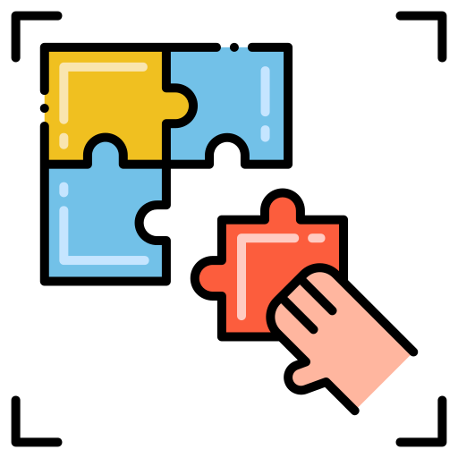

    Hi Everyone, My name is Mohammad Daffa

##  About me
- 
    
    Linux enthusiast
  
- 
    
    Interest with low-level programming
  
- 
    
    Not just programmer, but pro gamer. Actualy not so pro.
  
- 
    
    Sometimes like make some art.
  
- 
    
    Anime watchers, who have watch several season.
  

##  What tools I've used

 **Operating System**

 **Framework**